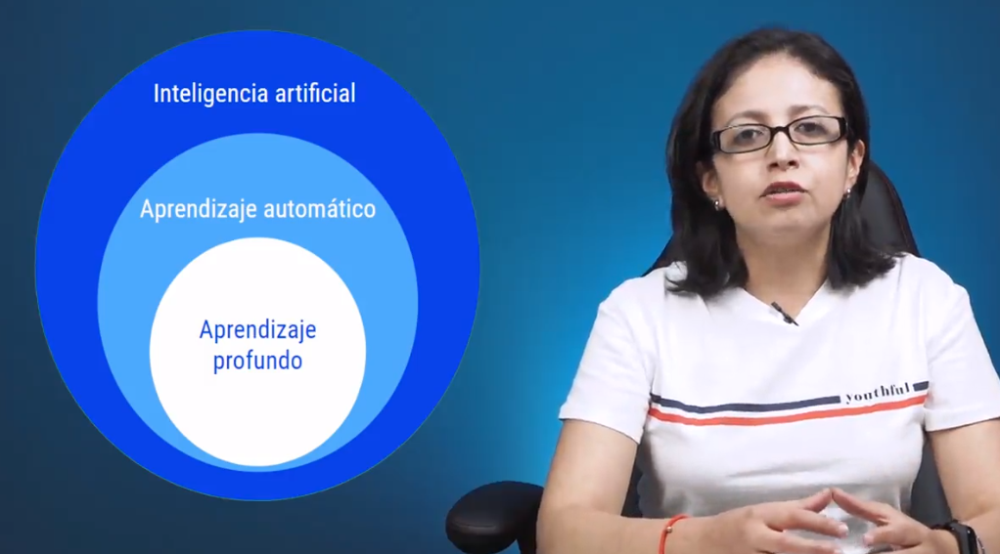
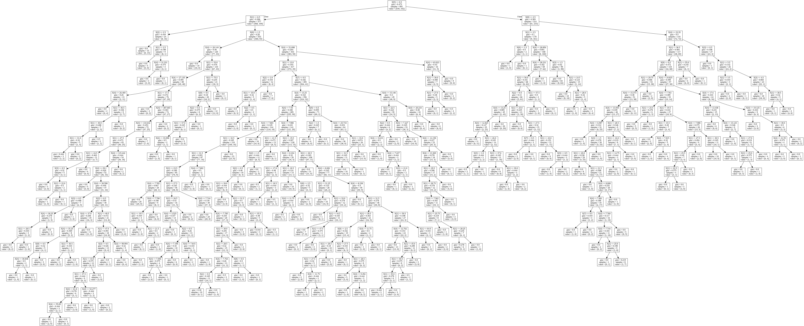

# Curso de Fundamentos Prácticos de Machine Learning

- [Curso de Fundamentos Prácticos de Machine Learning](#curso-de-fundamentos-prácticos-de-machine-learning)
	- [Modulo 1 Fundamentos prácticos](#modulo-1-fundamentos-prácticos)
		- [Clase 1 Aplica Platzidoro en este curso y asegura el éxito de tu aprendizaje](#clase-1-aplica-platzidoro-en-este-curso-y-asegura-el-éxito-de-tu-aprendizaje)
		- [Clase 2 Introducción al Curso](#clase-2-introducción-al-curso)
			- [Que es el Machine learning](#que-es-el-machine-learning)
		- [Clase 3 Introducción a Numpy](#clase-3-introducción-a-numpy)
			- [Ejercicio Colab](#ejercicio-colab)
		- [Clase 4 Introducción y manipulación de datos con Pandas](#clase-4-introducción-y-manipulación-de-datos-con-pandas)
			- [Pandas](#pandas)
			- [Ejercicio](#ejercicio)
		- [Clase 5 Introducción a ScikitLearn](#clase-5-introducción-a-scikitlearn)
			- [**ScikitLearn**](#scikitlearn)
		- [Clase 6 Comandos básicos de las librerías usadas en el curso (Numpy, Pandas y ScikitLearn)](#clase-6-comandos-básicos-de-las-librerías-usadas-en-el-curso-numpy-pandas-y-scikitlearn)
			- [Numpy](#numpy)
	- [Pandas](#pandas-1)
	- [Scikit Learn](#scikit-learn)
	- [Modulo 2 Regresión Lineal y Logística](#modulo-2-regresión-lineal-y-logística)
		- [Clase 7 ¿Qué es la predicción de datos?](#clase-7-qué-es-la-predicción-de-datos)
		- [Clase 8 Sobreajuste y subajuste en los datos](#clase-8-sobreajuste-y-subajuste-en-los-datos)
		- [Clase 9 Regresión lineal simple y regresión lineal múltiple](#clase-9-regresión-lineal-simple-y-regresión-lineal-múltiple)
			- [Regresion Lineal Simple](#regresion-lineal-simple)
			- [Regresion Lineal Multiple](#regresion-lineal-multiple)
		- [Clase 10 Regresión lineal simple con Scikit-Learn: división de los datos](#clase-10-regresión-lineal-simple-con-scikit-learn-división-de-los-datos)
		- [Clase 11 Regresión lineal simple con Scikit-Learn: creación del modelo](#clase-11-regresión-lineal-simple-con-scikit-learn-creación-del-modelo)
		- [Clase 12 Regresión logística con Scikit-Learn: definición y división de datos](#clase-12-regresión-logística-con-scikit-learn-definición-y-división-de-datos)
		- [Clase 13 Regresión logística con Scikit-Learn: evaluación del modelo](#clase-13-regresión-logística-con-scikit-learn-evaluación-del-modelo)
			- [Ejercicio parte 2](#ejercicio-parte-2)
			- [Notas Adicionales a esta clase](#notas-adicionales-a-esta-clase)
		- [Clase 14 Matriz de confusión](#clase-14-matriz-de-confusión)
		- [Clase 15 PlatziDoro Cápsula 1](#clase-15-platzidoro-cápsula-1)
	- [Modulo 3 Árboles de decisión](#modulo-3-árboles-de-decisión)
		- [Clase 16 ¿Qué es un árbol de decisión y cómo se divide?](#clase-16-qué-es-un-árbol-de-decisión-y-cómo-se-divide)
			- [Como se dide un arbol de decision?](#como-se-dide-un-arbol-de-decision)
			- [Optimizacion de nuestro modelo](#optimizacion-de-nuestro-modelo)
		- [Clase 17 Comprendiendo nuestro data set para la creación de un árbol de decisión](#clase-17-comprendiendo-nuestro-data-set-para-la-creación-de-un-árbol-de-decisión)
		- [Clase 18 Creando un clasificador con Scikit-Learn](#clase-18-creando-un-clasificador-con-scikit-learn)
		- [Clase 19 Entrenamiento del modelo de clasificación](#clase-19-entrenamiento-del-modelo-de-clasificación)
	- [Modulo 4 Arboles de decisión](#modulo-4-arboles-de-decisión)
		- [Clase 20 Visualización del árbol de decisión](#clase-20-visualización-del-árbol-de-decisión)
	- [Modulo 5 K-Means](#modulo-5-k-means)
		- [Clase 21 ¿Qué es K-Means?](#clase-21-qué-es-k-means)
			- [Metodo del codo](#metodo-del-codo)
		- [Clase 22 Cargando el data set de Iris](#clase-22-cargando-el-data-set-de-iris)
		- [Clase 23 Construcción y evaluación del modelo con K-Means](#clase-23-construcción-y-evaluación-del-modelo-con-k-means)
		- [Clase 24 Graficación del modelo](#clase-24-graficación-del-modelo)
		- [Clase 25 PlatziDoro Cápsula 2](#clase-25-platzidoro-cápsula-2)
	- [Modulo 6 Aprendizaje profundo](#modulo-6-aprendizaje-profundo)
		- [Clase 26 Introducción al aprendizaje profundo](#clase-26-introducción-al-aprendizaje-profundo)
			- [Que es ReLU](#que-es-relu)
		- [Clase 27 Conceptos básicos de Tensor Flow](#clase-27-conceptos-básicos-de-tensor-flow)
		- [Clase 28 Red neuronal convolucional](#clase-28-red-neuronal-convolucional)
			- [Red neuronal convolucional](#red-neuronal-convolucional)
		- [Clase 29 Conociendo el set de datos para la creación de la red neuronal](#clase-29-conociendo-el-set-de-datos-para-la-creación-de-la-red-neuronal)
		- [Clase 30 Crea y entrena tu primera red neuronal convolucional con Tensor Flow](#clase-30-crea-y-entrena-tu-primera-red-neuronal-convolucional-con-tensor-flow)
		- [Clase 31 Evaluación de la red convolucional](#clase-31-evaluación-de-la-red-convolucional)
		- [Clase 32 PlatziDoro Cápsula 3](#clase-32-platzidoro-cápsula-3)
	- [Modulo 7 Despedida](#modulo-7-despedida)
		- [Clase 33 Recomendaciones para analizar correctamente tu problema](#clase-33-recomendaciones-para-analizar-correctamente-tu-problema)
	- [Recursos Adicionales](#recursos-adicionales)
## Modulo 1 Fundamentos prácticos

### Clase 1 Aplica Platzidoro en este curso y asegura el éxito de tu aprendizaje

La metodología de Platzi ha iterado para ofrecerte la mejor experiencia de aprendizaje a través de Platzidoro: la técnica Pomodoro al servicio de la educación efectiva.

Esta metodología se enfoca en enseñarte a aprender evitando o superando momentos de frustración, distracción y agotamiento, mostrándote qué recursos pedagógicos puedes usar para aprender de forma efectiva, además de enseñarte cómo aplicarlos al tema que quieres aprender.

¡Aprende a aprender ahora!

[https://youtu.be/BAB7ev7Vg_I](https://youtu.be/BAB7ev7Vg_I)

Identificamos los momentos clave del curso para generar espacios de pausa guiada en donde tienes la oportunidad de resumir y practicar lo que has aprendido, a través de herramientas de estudio y juegos didácticos aplicados al tema que estás aprendiendo. Esto no solo te ayuda a que seas consciente de tu propio proceso de aprendizaje, sino que te llena de herramientas de estudio útiles en las áreas de tu interés.

A través de esta metodología te enseñamos a gestionar tus tareas y tu tiempo o el de tu propia empresa, empezando por la gestión que haces de tus propio flujo de trabajo y el ejemplo que das.

Platzidoro está disponible en este curso. ¿Qué esperas para comenzar?

[Volver a tabla de contenidos](#curso-de-fundamentos-prácticos-de-machine-learning)

### Clase 2 Introducción al Curso

Introduccion por Yesi Diaz, egresada de la UV en xalapa 



#### Que es el Machine learning

Capacidad de un algoritmo de adquirir conocimiento a partir de observaciones, aprender de los datos para mejorar, descubrir y predecir  resultados, puede ser **supervisado** (con etiquetas) o **no supervisado (**el algoritmo encuentra relaciones entre los featuress).

Pasos del Machine learning

- Definir problema
- Construcion del modelo y evaluacion
- Deploy y mejoras

[Volver a tabla de contenidos](#curso-de-fundamentos-prácticos-de-machine-learning)

### Clase 3 Introducción a Numpy

Razones para usar Numpy

- Sencilla de usar
- Adecuada para el manejo de arreglos (te ahorras los for each)
- Rapida

#### Ejercicio Colab


[Volver a tabla de contenidos](#curso-de-fundamentos-prácticos-de-machine-learning)

### Clase 4 Introducción y manipulación de datos con Pandas

#### Pandas

Biblioteca de codigo abierto que proporciona estructuras de datos y herramientas de analisis de datos de alto rendimiento y faciles de usar.

- manejo de archivos
- Series(1D)
- Dataframes(2D)
- Panels(3D)

#### Ejercicio


[Volver a tabla de contenidos](#curso-de-fundamentos-prácticos-de-machine-learning)

### Clase 5 Introducción a ScikitLearn

#### **ScikitLearn**

Biblioteca de codigo abierto para el aprendizaje automatico, incluye algoritmos como arboles de desicion, regresion, maquina de soporte vectorial entre otros.

Importancia:

- Variedad de modulos (tiene todos los algoritmos integrados)
- Versatilidad
- Facil de usar

```python
from sklearn import [modelo]  // modelo 
from sklearn import tree // algoritmo arbol decisión
```

[Volver a tabla de contenidos](#curso-de-fundamentos-prácticos-de-machine-learning)

### Clase 6 Comandos básicos de las librerías usadas en el curso (Numpy, Pandas y ScikitLearn)

#### Numpy

Biblioteca de Python comúnmente usada en la ciencias de datos y aprendizaje automático (Machine Learning). Proporciona una estructura de datos de matriz que tiene diversos beneficios sobre las listas regulares.

**Importar la biblioteca:** 

```python
import numpy as np
```

**Crear arreglo unidimensional:**

```python
my_array = np.array([1, 2, 3, 4, 5])
```

*Resultado:* 

```python
array([1, 2, 3, 4, 5])
```

**Crear arreglo bidimensional:**

```python
np.array( [['x', 'y', 'z'], ['a', 'c', 'e']])
```

*Resultado:*

```python
[['x' 'y' 'z']['a' 'c' 'e']]
```

**Mostrar el número de elementos del arreglo:**

```python
len(my_array)
```

**Sumar todos los elementos de un arreglo unidimensional:**

```python
np.sum(my_array)
```

**Obtener el número máximo de los elementos del arreglo unidimensional**

```python
np.max(my_array)
```

**Crear un arreglo de una dimensión con el número 0:**

```python
np.zeros(5)
```

*Resultado:* 

```python
array([0., 0., 0., 0., 0.])
```

**Crear un arreglo de una dimensión con el número 1:**

```python
np.ones(5)
```

*Resultado:* 

```python
array([1., 1., 1., 1., 1.])
```

**Comando de Python para conocer el tipo del dato:**

```python
type(variable)
```

**Ordenar un arreglo:**

```python
np.order(x)
```

**Ordenar un arreglo por su llave:**

```python
np.sort(arreglo, order='llave')
```

**Crear un arreglo de 0 a N elementos:**

np.arange(n)

```python
np.arange(25)
```

*Resultado:*

```python
array([ 0, 1, 2, 3, 4, 5, 6, 7, 8, 9, 10, 11, 12, 13, 14, 15, 16,17, 18, 19, 20, 21, 22, 23, 24])
```

**Crear un arreglo de N a M elementos:**

```python
np.arange(5, 30)
```

```python
*Resultado:*array([ 5, 6, 7, 8, 9, 10, 11, 12, 13, 14, 15, 16, 17, 18, 19, 20, 21,22, 23, 24, 25, 26, 27, 28, 29])
```

**Crear un arreglo de N a M elementos con un espacio de cada X valores:**

np.arange(n, m, x)

```python
np.arange(5, 50, 5)
```

*Resultado:*

```python
array([ 5, 10, 15, 20, 25, 30, 35, 40, 45])
```

**Crear arreglo de NxM:**

```python
my_array = np.array[[1, 2, 3],
										[4, 5, 6]]
```

**Número de elementos del arreglo:**len(my_array)

## Pandas

Pandas es una herramienta de manipulación de datos de alto nivel, es construido con la biblioteca de Numpy. Su estructura de datos más importante y clave en la manipulación de la información es DataFrame, el cuál nos va a permitir almacenar y manejar datos tabulados observaciones (filas) y variables (columnas).

**Importar la biblioteca:**

```python
import pandas as pd
```

**Generar una serie con Pandas:**

```python
pd.Series([5, 10, 15, 20, 25])
```

*Resultado:*

```python
0 51 102 153 204 25
```

**Crear un Dataframe:**

```python
lst = ['Hola', 'mundo', 'robótico']
df = pd.DataFrame(lst)
```

*Resultado:*

```python
0
0 Hola
1 mundo
2 robótico
```

**Crear un Dataframe con llave y dato:**

```python
data = {'Nombre':['Juan', 'Ana', ‘Toño', 'Arturo'], 
				'Edad':[25, 18, 23, 17],
				'Pais': ['MX', 'CO', 'BR', 'MX'] }

df = pd.DataFrame(data)*Resultado:*
```


**Leer archivo CSV:**

```python
pd.read_csv('archivo.csv')
```

**Mostrar cabecera:**

```python
data.head(n)
```

**Mostrar columna del archivo leído:**

```python
data.columna_interes
```

**Mostrar los últimos elementos:**

```python
data.tail()
```

**Mostrar tamaño del archivo leído:**

```python
data.shape
```

**Mostrar columnas:**

```python
data.columns
```

**Describe una columna:**

```python
data['columna'].describe()
```

**Ordenar datos del archivo leído:**

```python
data.sort_index(axis = 0, ascending = False)
```

## Scikit Learn

Scikit Learn es una biblioteca de Python que está conformada por algoritmos de clasificación, regresión, reducción de la dimensionalidad y clustering. Es una biblioteca clave en la aplicación de algoritmos de Machine Learning, tiene los métodos básicos para llamar un algoritmo, dividir los datos en entrenamiento y prueba, entrenarlo, predecir y ponerlo a prueba.

**Importar biblioteca:**

```python
from sklearn import [modulo]
```

**División del conjunto de datos para entrenamiento y pruebas:**

```python
X_train, X_test, y_train, y_test = train_test_split(X, y, test_size = 0.25, random_state = 0)
```

**Entrenar modelo:**

```python
[modelo].fit(X_train, y_train)
```

**Predicción del modelo:**

```python
Y_pred = [modelo].predict(X_test)
```

**Matriz de confusión:**

```python
metrics.confusion_matrix(y_test, y_pred)
```

**Calcular la exactitud:**

```python
metrics.accuracy_score(y_test, y_pred)
```

[Volver a tabla de contenidos](#curso-de-fundamentos-prácticos-de-machine-learning)

## Modulo 2 Regresión Lineal y Logística

### Clase 7 ¿Qué es la predicción de datos?

Lo importante de trabajar con datos es crear un modelo entrenado, este podra crear una regresion o una clasificacion, la informacion que se pase a un modelo debe ser curada y de calidad.

Lo primero a pensar es que problema quiero resolver, lo segundo obtener la data.

[Volver a tabla de contenidos](#curso-de-fundamentos-prácticos-de-machine-learning)

### Clase 8 Sobreajuste y subajuste en los datos

El sobreajuste (overfitting) es cuando entrenamos un modelo intentando que ajuste a la perfeccion en los escenarios de test, pero cuando pasas data desconocida al modelo este fallara, pues se acostumbro a la data que conocia unicamente y el subajuste (underfitting) se da cuando la data que pasamos es muy pobre en volumen y no logra ser suficiente para entrenar el modelo. La data siempre debera ser rica en variedad y de considerable volumen.


Si al algoritmo solo pasamos datos de gatos blanco el algoritmo no clasificara al gato negro


Para empezar, la recomendacion de datos 70 a 75 seran training, el resto sera para test

[Volver a tabla de contenidos](#curso-de-fundamentos-prácticos-de-machine-learning)

### Clase 9 Regresión lineal simple y regresión lineal múltiple

#### Regresion Lineal Simple

Algoritmo de aprendizaje supervisado que ***nos indica la tendencia de un conjunto de datos continuos***, modelando la relacion entre una ***variable dependiente Y*** y una ***variable explicativa X***


#### Regresion Lineal Multiple

Si nuestro problema tiene mas de dos variables se le considera lineal multiple, y entonces hablamos  de un **hiperplano**, estos algoritmos solo funcionan con **datos cuantitativos**

[Volver a tabla de contenidos](#curso-de-fundamentos-prácticos-de-machine-learning)

### Clase 10 Regresión lineal simple con Scikit-Learn: división de los datos


[Volver a tabla de contenidos](#curso-de-fundamentos-prácticos-de-machine-learning)

### Clase 11 Regresión lineal simple con Scikit-Learn: creación del modelo


Los creditos de la solucion del reto son de mi amigo @gersonrpq (buscalo en twitter)

[Volver a tabla de contenidos](#curso-de-fundamentos-prácticos-de-machine-learning)

### Clase 12 Regresión logística con Scikit-Learn: definición y división de datos

Si nuestro dato de salida tiene un valor cualitativo (algun tag que corresponde a una clasificacion) utilizamos y aplicamos la regresion logistica, este contiene los principios del anterior pero lo usamos para clasificar.

Usaremos un dataset de diabetes, utilizaremos la regresion logistica para clasificar a nuevos pacientes, utilizaremos la funcion de activacion sigmoide 


Ejercicio


[Volver a tabla de contenidos](#curso-de-fundamentos-prácticos-de-machine-learning)

### Clase 13 Regresión logística con Scikit-Learn: evaluación del modelo

En la clase anterior utilizando el dataset creamos y LogisticRegresion creamos un modelo donde al ingresar caracteristicas de nuevos pacientes podemos predecir cuando un paciente puede tener diabetes, ahora evaluaremos el modelo.

Podemos saber cuando un modelo lo esta haciendo bien o mal, hay dos maneras, la matriz de confusion que ademas nos permite calcular el [Accuracy, Precision, Recall, F1 Score](https://medium.com/analytics-vidhya/confusion-matrix-accuracy-precision-recall-f1-score-ade299cf63cd), otra manera es usando ScikitLearn usando la mismas metricas


#### Ejercicio parte 2


Nota Y_test y y_pred ambos tiene 192 valores que fueron comparados entre si, la suma de los cuadrantes de la matriz es 192.

#### Notas Adicionales a esta clase

[https://external-content.duckduckgo.com/iu/?u=https%3A%2F%2Fi0.wp.com%2Fwww.aprendemachinelearning.com%2Fwp-content%2Fuploads%2F2019%2F05%2Fconfusion_matix_example.png&f=1&nofb=1](https://external-content.duckduckgo.com/iu/?u=https%3A%2F%2Fi0.wp.com%2Fwww.aprendemachinelearning.com%2Fwp-content%2Fuploads%2F2019%2F05%2Fconfusion_matix_example.png&f=1&nofb=1)

**Accuracy o Exactitud**
**Accuracy** es una métrica que generalmente **describe cómo funciona el modelo en todas las clases**. Es útil cuando todas las clases tienen la misma importancia. Se calcula como la relación entre el número de predicciones correctas y el número total de predicciones.


**Precision**
La **precision** se calcula como la **relación entre el** **número de muestras positivas clasificadas correctamente y el número total de muestras clasificadas como positivas (ETIQUETADAS CORRECTA O INCORRECTAMENTE**). La precisión mide la precisión del modelo al clasificar una muestra como positiva. Aunque tambien podrias invertir la metrica para muestras negativas si es que te interesa.


> La **precisión** refleja cuán confiable es el modelo para clasificar muestras como positivas.

**Recall**

El **recall** se calcula como la **relación entre el número de muestras positivas correctamente clasificadas como positivas y el número total de muestras positivas REALES.** El retiro mide la capacidad del modelo para detectar muestras positivas. Cuanto mayor sea el **recall**, más muestras positivas detectadas


Cuando el **recall** tiene un valor entre 0.0 y **1.0**, este valor refleja el porcentaje de muestras positivas que el modelo clasificó correctamente como **Positivo**. Por ejemplo, si hay 10 muestras positivas y el **recall e**s **0,6**, esto significa que **el modelo clasificó correctamente el 60% de las muestras positivas** (es decir, 0,6 * 10 = 6 muestras positivas están clasificadas correctamente).

**F1 score es la media armónica de precisión y recall,** se utiliza como métrica en los escenarios en los que la elección de precisión o puntuación de recuperación puede resultar en un compromiso en términos de modelo que da altos falsos positivos y falsos negativos, respectivamente.

$$F1 Score = 2*(Recall * Precision) / (Recall + Precision)$$

¿**Que metrica tomar en cuenta Precision o Recall?**

La decisión de usar **precisión** o **recall** depende del tipo de problema que se resuelva. Si el objetivo es **detectar todas las muestras positivas** (sin importar si las muestras negativas se clasificarían erróneamente como positivas), **utilice la recall**. Utilice **precisión si el problema es sensible a la clasificación de una muestra como Positiva en general**, es decir, incluyendo **muestras negativas que fueron clasificadas falsamente como Positivas.**

Imagina que te dan una imagen y te piden que detectes todos los autos dentro de ella. ¿Qué métrica usas? Dado que el objetivo es detectar todos los coches, utilice la función de **recall**. Esto puede clasificar erróneamente algunos objetos como autos, pero eventualmente funcionará para detectar todos los objetos objetivo.

Ahora digamos que le dan una **imagen de mamografía y se le pide que detecte si hay cáncer o no**. ¿Qué métrica usas? Debido a que es sensible a identificar incorrectamente una imagen como cancerosa, debemos estar seguros al clasificar una imagen como Positiva (es decir, tiene cáncer). Por tanto, la **precisión** es la métrica preferida.

[Volver a tabla de contenidos](#curso-de-fundamentos-prácticos-de-machine-learning)

### Clase 14 Matriz de confusión

Los modelos de clasificación son capaces de predecir cuál es la etiqueta correspondiente a cada ejemplo o instancia basado en aquello que ha aprendido del conjunto de datos de entrenamiento. Estos modelos necesitan ser evaluados de alguna manera y posteriormente comparar los resultados obtenidos con aquellos que fueron entrenados.

Una manera de hacerlo es mediante la matriz de confusión la cual nos permite evaluar el desempeño de un algoritmo de clasificación a partir del conteo de los aciertos y errores en cada una de las clases del algoritmo.

Como su nombre lo dice tenemos una matriz que nos ayuda a evaluar la predicción mediante positivos y negativos como se muestra en la figura.


Los **verdaderos positivos (VP)** son aquellos que fueron clasificados correctamente como positivos como el modelo.

Los **verdaderos negativos (VN)** corresponden a la cantidad de negativos que fueron clasificados correctamente como negativos por el modelo.

Los **falsos negativos (FN)** es la cantidad de positivos que fueron clasificados incorrectamente como negativos.

Los **falsos positivos (FP)** indican la cantidad de negativos que fueron clasificados incorrectamente como negativos.

Para que lo anterior quede más claro consideremos el siguiente ejemplo.

Un médico tiene cuatro pacientes y a cada uno se les solicitó un examen de sangre y por error el laboratorio realizó también un estudio de embarazo, cuando los pacientes llegan el médico les da los resultado.

A la primera paciente le da la noticia que está embarazada y ella ya lo sabía dado que tiene 3 meses de embarazo, es decir, un verdadero positivo.

El siguiente paciente llega y le dice que no está embarazada y es una clasificación evidente dado que es hombre (Verdadero negativo).

El tercer paciente llega y los resultados le indican que no está embarazada sin embargo tiene cuatro meses de embarazo, es decir, que la ha clasificado como falso negativo.

Y por último el cuarto paciente sus resultados han indicado que está embarazado sin embargo es hombre por lo cual es imposible, dando como resultado un falso positivo.

Lo anterior es un proceso que se realiza por cada instancia a clasificar y nos permite calcular la exactitud y su tasa de error con las siguientes fórmulas.


Por lo tanto a mayor exactitud nuestro modelo ha aprendido mejor.

[Volver a tabla de contenidos](#curso-de-fundamentos-prácticos-de-machine-learning)

### Clase 15 PlatziDoro Cápsula 1

Capsula de repaso de los temas anteriores.

[Volver a tabla de contenidos](#curso-de-fundamentos-prácticos-de-machine-learning)

## Modulo 3 Árboles de decisión

### Clase 16 ¿Qué es un árbol de decisión y cómo se divide?


La parte azul es la pregunta a responder,  D las decisiones, cuando el arbol se empieza a dividir tenemos un 1 o un cero.

Ventjas

- Claridad en los datos
- Tolerantes al ruido y valores faltantes
- Las reglas extraidas permiten hacer predicciones.

Este modelo **se usa** regularmente cuando quieres saber **si una persona va a comprar un articulo** Este es uno de los clasificadores mas utiles que hay porque te ayuda a integrarlo a diferentes casos. Amazon puede utilizar este algoritmo para saber si compraras o no

Desventajas

- Criterio de division es deficiente
- Sobreajuste
- Ramas poco significativas


#### Como se dide un arbol de decision?

- Ganancia de informacion
- Dividir en pequeños arboles

#### Optimizacion de nuestro modelo

- Evitar sobreajuste
- Seleccion de atributos
- Campos nulos

[Volver a tabla de contenidos](#curso-de-fundamentos-prácticos-de-machine-learning)

### Clase 17 Comprendiendo nuestro data set para la creación de un árbol de decisión


[Volver a tabla de contenidos](#curso-de-fundamentos-prácticos-de-machine-learning)

### Clase 18 Creando un clasificador con Scikit-Learn


[Volver a tabla de contenidos](#curso-de-fundamentos-prácticos-de-machine-learning)

### Clase 19 Entrenamiento del modelo de clasificación


[Volver a tabla de contenidos](#curso-de-fundamentos-prácticos-de-machine-learning)

## Modulo 4 Arboles de decisión

### Clase 20 Visualización del árbol de decisión




X es cada uno de los atributos, si se cumple me ire por el dato izquierdo con verdadero

[Volver a tabla de contenidos](#curso-de-fundamentos-prácticos-de-machine-learning)

## Modulo 5 K-Means

### Clase 21 ¿Qué es K-Means?

K-means (k-medias en español) es un algoritmo **no supervisado o sin tags**, su objetivo es poder agrupar informacion dadas sus caracteristicas. Crea K grupos a partir de un conjunto de observaciones, los elementos deben tener similitudes.

Se utiliza mucho en e-commerce si tenemos etiquetas similares en los productos


K_means

- (1) Seleccionar un valor para K (o centroides)
- (2) Asignamos cada uno de los elementos restantes al centro mas cercano.

Supongamos que en la siguiente imagen tenemos represantadas personas con intereses en tecnologia, deportes, y libros.


- (3) Asignamos cada punto a su centroide mas cercano
- (4) Repetimos paso 2 y paso 3 hasa que los centros no se modifiquen


#### Metodo del codo

Este metodo divide los siguientes centrides o la informacion hasta graficarlo en un plano


El rompimiento de los puntos es el numero de K que debemos agragar al algoritmo

- Calcula el agrupamiento para diferentes de K.
- El error al cuadrado para cada punto es el cuadrado de la distancia del punto desde su centro.

[Volver a tabla de contenidos](#curso-de-fundamentos-prácticos-de-machine-learning)

### Clase 22 Cargando el data set de Iris


[Volver a tabla de contenidos](#curso-de-fundamentos-prácticos-de-machine-learning)

### Clase 23 Construcción y evaluación del modelo con K-Means


[Volver a tabla de contenidos](#curso-de-fundamentos-prácticos-de-machine-learning)

### Clase 24 Graficación del modelo


[Volver a tabla de contenidos](#curso-de-fundamentos-prácticos-de-machine-learning)

### Clase 25 PlatziDoro Cápsula 2

Hasta ahora has aprendido qué es un árbol de decisión y cómo se divide. Comprendiste la estructura de los data sets iris, diabetes y titanic. Recibiste tips y recomendaciones para saber cuándo usar un algoritmo de regresión lineal simple o un algoritmo de regresión logística. Además entendiste las ventajas y desventajas de los árboles de decisión aplicados a Machine Learning.

¿Estás listo para poner a prueba lo aprendido?

Te quiero retar a que descargues la actividad **[Crucigrama Fundamentos ML](https://drive.google.com/open?id=1GgeSb3N0tgjZBis_5IFu9J7Bo4eeKFjEzJmIpNzchE8)** y comparte tus resultados en los comentarios de esta lectura. Encontrarás la respuesta correcta, en la sección de archivos del próximo Platzidoro.

[Volver a tabla de contenidos](#curso-de-fundamentos-prácticos-de-machine-learning)

## Modulo 6 Aprendizaje profundo

### Clase 26 Introducción al aprendizaje profundo

- Herramientas: pyTorch y TensorFlow
- Subcategoría de ML que crea diferentes niveles, de abstracción que representa los datos.
- Se usan tensores para representar estructuras de datos más complejas.
- Neuronas: Capa de entrada, capas ocultas y capa de salida.
- Para poder aprender se necesita una función de activación: ReLU: Permite el paso de todos los valores positivos sin cambiarlos, pero asigna todos los valores negativos a 0.
- TensorFlow: Biblioteca de código abierto desarrollado por google, capaz de construir y entrenar redes neuronales.


#### Que es ReLU

Funcion de activacion, permite el paso de todos los valores positivos sin cambiarlos pero asigna todos los valores negativos a cero.


[Volver a tabla de contenidos](#curso-de-fundamentos-prácticos-de-machine-learning)

### Clase 27 Conceptos básicos de Tensor Flow

Tensor Flow es una biblioteca de software de código abierto que permite construir y entrenar redes neuronales, permite detectar y descifrar patrones en los datos. Es un desarrollo de Google y que debido a su flexibilidad y extensa comunidad de programadores ha crecido rápidamente y se ha posicionado como la herramienta líder en el estudio del aprendizaje profundo o también conocido como Deep Learning.

Tensor Flow puede ser usado para ayudar al diagnóstico médico, detectar objetos, procesar imágenes, detección de emociones en el rostro, entre otras aplicaciones. En este curso usamos Tensor Flow para crear nuestra primera red neuronal y diseñar un clasificador de imágenes a partir de un conjunto de datos.

```python
# Importar la biblioteca:
import tensorflow as tf
```

```python
# Importar el modelo:
from tensorflow import keras
```

```python
# Cargar conjunto de datos de Tensor Flow:
fashion_mnist = keras.datasets.fashion_mnist
(train_images, train_labels), (test_images, test_labels) = fashion_mnist.load_data()
```

```python
# Crear modelo secuencial:
model = keras.Sequential([keras.layers.Flatten(input_shape = (28, 28)), 
													keras.layers.Dense(128, activation = tf.nn.relu), 
													keras.layers.Dense(10, activation = tf.nn.softmax)])
```

```python
# Compilación del modelo:
model.compile(optimizer=tf.train.AdamOptimizer(), 
							loss='sparse_categorical_crossentropy', 
							metrics = ['accuracy'])
```

```python
# Entrenamiento:
model.fit(train_images, train_labels, epochs = 5)
```

```python
# Evaluación del modelo:
test_loss, test_acc = model.evaluate( test_images, test_labels )
```

```python
# Predicción del modelo:
model.predict(test_images)
```

[Volver a tabla de contenidos](#curso-de-fundamentos-prácticos-de-machine-learning)

### Clase 28 Red neuronal convolucional

#### Red neuronal convolucional

Modelan de forma consecutiva pequeñas piezas de informacion, al final combinan informacion en las capas profundas de la red.

Ésta red es especial para trabajar imágenes y audios.


[Volver a tabla de contenidos](#curso-de-fundamentos-prácticos-de-machine-learning)

### Clase 29 Conociendo el set de datos para la creación de la red neuronal


Dividimos entre 255 para normalizar los pixeles a un valor entre 0 y 1 y convertir las imagenes en escala de grises, para resolver otras dudas leer mismo ejemplo en [documentacion](https://www.tensorflow.org/tutorials/keras/classification)

[Volver a tabla de contenidos](#curso-de-fundamentos-prácticos-de-machine-learning)

### Clase 30 Crea y entrena tu primera red neuronal convolucional con Tensor Flow


1875 indica el número de batch con el que se entrena (cada batch consta de 32 imagenes por default). Se está entrenando con el algoritmo de Adam (una variación avanzada de Batch Gradient Descent). 1875*32=60,000 imagenes.

[Volver a tabla de contenidos](#curso-de-fundamentos-prácticos-de-machine-learning)

### Clase 31 Evaluación de la red convolucional


[Volver a tabla de contenidos](#curso-de-fundamentos-prácticos-de-machine-learning)

### Clase 32 PlatziDoro Cápsula 3

Resumen clases anteriores

[Volver a tabla de contenidos](#curso-de-fundamentos-prácticos-de-machine-learning)

## Modulo 7 Despedida

### Clase 33 Recomendaciones para analizar correctamente tu problema


Probabilidad de ocurrencia de ciertos eventos, Amazon para predecir personal para envios o stock proximos meses


Netflix usa árboles de decisión para las recomendaciones. También es usado en tiendas en línea. También en redes sociales, pronosticar clima, y resultado en farmacos.


k-means: encuentra grupos con características similares. En los libros. Ya se aplica en la industria. patrones en la conducta de compras. anti-fraude


Redes neuronales: es lo que más se aplica en la industria, es lo que más se ve. aplicaciones en móviles, filtros, mood status. etc.


Trabajar con audio o imagenes, reconocimiento de patrones

[Volver a tabla de contenidos](#curso-de-fundamentos-prácticos-de-machine-learning)

## Recursos Adicionales

[Como guardar un modelo y reutilizarlo](https://stackabuse.com/scikit-learn-save-and-restore-models/) 

[Matriz de confusion](https://scikit-learn.org/stable/modules/generated/sklearn.metrics.ConfusionMatrixDisplay.html?highlight=metrics%20confusionmatrixdisplay)

[Metricas accuracy, precision, recall, f1](https://towardsdatascience.com/accuracy-recall-precision-f-score-specificity-which-to-optimize-on-867d3f11124)

[Datasets recomendados 1](https://archive.ics.uci.edu/ml/datasets.php)

[Datasets recomendados 2](https://medium.com/towards-artificial-intelligence/the-50-best-public-datasets-for-machine-learning-d80e9f030279)